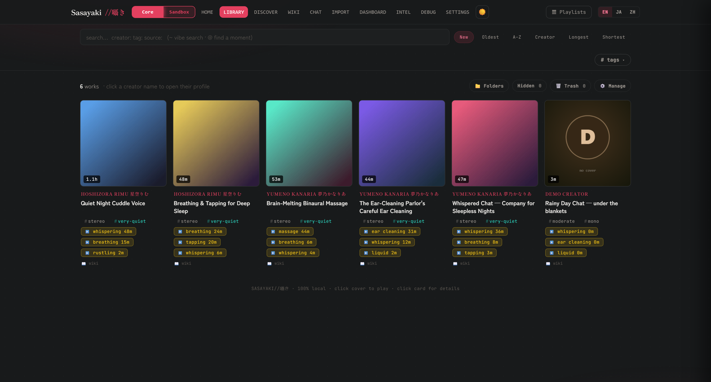
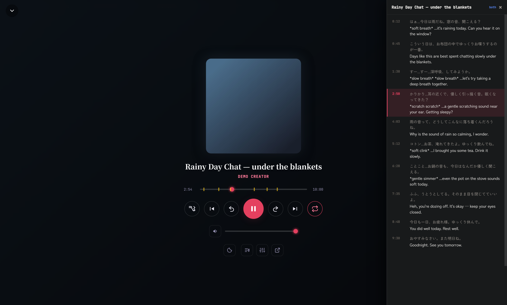
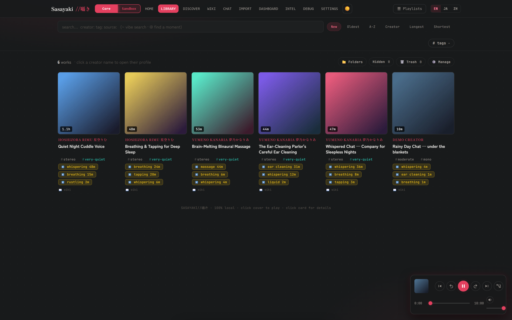

<div align="center">

# 囁き · Sasayaki — CPU-only core

**a self-hosted browser/player for an ASMR library you already have, with a comprehension
pipeline that grows into it**

`browse → play → search → tag → organize` · runs on a Raspberry Pi · zero GPU required




*Point it at a folder of audio you already own. Get a real library: covers, bilingual titles,
acoustic tags, and per-work sound-event chips — all built locally by the included CPU-only indexers.*

</div>

---

## what this repo is

This is the **Tier 0 core**: the practical, Jellyfin-equivalent viewer. Point it at a folder of
audio (or video) you already own, `docker compose up`, and get a real library UI — search, tags,
per-creator pages, DLsite metadata, realms, a persistent player that survives page navigation,
bilingual subtitle playback and trigger/timeline markers if that data already exists. **No GPU, no
models, no scrapers, no network calls.**

**No authentication.** This is a personal media server, not a multi-tenant app — anyone who can
reach the port can browse and play. Run it on your LAN only, or put it behind your own
reverse-proxy/VPN if you want to reach it from outside your network.

The full Sasayaki project also includes a **GPU comprehension pipeline** — ASR tuned for ASMR
(anime-whisper, a Whisper fine-tune that doesn't hallucinate on breathy non-verbal audio), local-LLM
JA→EN translation with onomatopoeia rendered as stage directions, a self-grading reviewer, and a
research agent that builds a local wiki per creator. That pipeline is a **separate, optional worker
package, not published yet** — it writes its output into this same library's `_data/derived/`
folder, so the core here just picks it up. Nothing about running the core requires the worker to
exist. See [GPU_WORKER.md](GPU_WORKER.md) for a blueprint of what it does and how it's meant to
attach, if that's useful.

> Why a separate ASR fine-tune matters: vanilla Whisper hears breathy, non-verbal ASMR — kisses,
> ear-licking, soft breaths — finds no dictionary words, and hallucinates *"thanks for watching"*
> on a loop. That's the actual problem this project set out to solve; this core repo is the part
> of the result anyone can run today, on a CPU, without any of that machinery installed.

## what works with no GPU vs. what needs the worker

| Feature | Core (this repo, CPU) | Needs the GPU worker |
|---|:---:|:---:|
| Browse / play your library (audio + video) | ✅ | |
| Persistent player (`/app` shell — survives page navigation) | ✅ | |
| Full player transport — shuffle, repeat, 15s skip, keyboard shortcuts, OS media controls | ✅ | |
| Tag / genre filtering | ✅ | |
| DLsite metadata display | ✅ | |
| Sandbox / core realm split, hide/unhide | ✅ | |
| Library management — re-run pipeline per work, title overrides, folder view | ✅ | |
| Self-maintenance — one-command index rebuild + integrity check, schedulable | ✅ | |
| Delete/restore (moves the audio file) | ⚙️ *(opt-in — needs a `:rw` library mount, see INSTALL.md)* | |
| Subtitle playback (bilingual drawer) | ✅ *(if `.ja.srt`/`.en.srt` already exist)* | |
| Trigger/timeline markers | ✅ *(if `triggers.json` already exists)* | |
| Transcription (ASR) | | 🔧 |
| JA→EN translation | | 🔧 |
| Semantic "vibe" / moment search | | 🔧 |
| Trigger detection (CLAP sound-event classifier) | | 🔧 |
| Creator wiki + research agent | | 🔧 |
| AI chat console | | 🔧 |

Every GPU-only feature **degrades gracefully** — the route returns an empty result instead of
erroring, so the core UI never crashes because the worker isn't running.

## screenshots

> All screenshots show a **synthetic demo library** (generated sine-wave audio, fictional creators,
> hand-written demo subtitles) — not real works.

**Full player — bilingual subtitle drawer + trigger timeline.** Synced JA/EN cues with SFX rendered
as stage directions; the yellow ticks on the seek bar are detected sound-event regions (whispering,
ear-cleaning, liquid…) you can jump straight to:



**The persistent player (`/app`).** The mini player lives in a thin shell around the whole app —
navigate anywhere (library, wiki, discover, settings) and playback never stops:



## quickstart

See [INSTALL.md](INSTALL.md). Short version: this folder needs to sit inside your library as a
subfolder named `Sasayaki`, then `docker compose up -d --build`.

## keeping it healthy

One command rebuilds the derived state and verifies the library is intact — all local, no GPU, no
network, no AI:

```
pwsh ./maintain-library.ps1            # rebuild + verify (report only)
pwsh ./maintain-library.ps1 -Fix       # also repair the safe subset
pwsh ./maintain-library.ps1 -Schedule  # install a nightly job (Windows Task Scheduler)
```

It runs the four index builders in dependency order, then `library_doctor.py`. It exits non-zero
if a builder crashed or the doctor found something **actionable**. A no-change run takes seconds,
because `analyze_audio.py` skips files whose size+mtime are unchanged.

`library_doctor.py` can also be run on its own, and checks for the drift classes that actually
bite a long-lived library. It sorts findings into two buckets, which matters because the exit code
drives your scheduler's pass/fail — a checker that reports failure for cosmetic reasons trains you
to ignore it:

| | findings | exit |
|---|---|:---:|
| **actionable** | index entries whose file is gone · duplicate keys from mixed path separators · non-finite values that make the index invalid JSON · zero-byte/unreadable media | `1` |
| **advisory** | media not yet indexed · orphaned derived dirs · orphaned `.source.json` sidecars · orphaned thumb-cache entries · index keys using the other OS's path separator | `0` |

The advisory ones are steady state, not faults. Orphaned derived dirs are never auto-deleted
because one may hold the only surviving subtitles for a work whose media moved. Thumb-cache
orphans are regenerated on demand. And if you serve the same library from both Windows and Linux,
the index legitimately carries one OS's separators on the other — the server normalizes both, so
rewriting them would only invalidate the `SHA1(work_id)`-keyed thumb cache for nothing.

`--fix` only ever touches derived/cache data — **it never modifies or deletes your media.** After
repairing, the exit code reflects what's *left*, so a run that fixed everything reports success.

```
python3 library_doctor.py --root /media          # report; exit 1 only on actionable findings
python3 library_doctor.py --root /media --fix    # repair the safe subset
```

### if you also run a second, always-on copy

`nas-health-check.sh` is for the box that actually serves the dashboard when your authoring
machine is asleep. It checks the dashboard responds, that `library.json` is populated and
parseable, then runs the doctor — and alerts only on failure (via an existing `ntfy` topic in
`_jobs/ntfy_topic.txt`, if one is present). Point cron at it:

```
40 2 * * * /path/to/Sasayaki/nas-health-check.sh >/dev/null 2>&1
```

It is **report-only by design**. If that copy receives `_wiki/audio_index.json` from elsewhere
(Syncthing, rsync, a scheduled mirror), rebuilding the index there would diverge from the
authoring machine, be overwritten on the next sync, and churn the thumb cache — so repair stays
the authoring machine's job. Paths self-derive from the script's location;
`SASA_CONTAINER` / `SASA_BASE` / `SASA_ROOT` override the container name, dashboard URL and
in-container library root.

## stack

A single PowerShell 7 `HttpListener` server (`Show-SubtitlerLog.ps1 -Serve`) + static HTML/JS pages
+ seven **stdlib-only** Python scripts (no pip installs, no ML libraries): `subs_for.py` (subtitle
serving), `paths.py` (path resolution), four index builders — `analyze_audio.py` (acoustic
index), `build_tags.py` (tags), `process_ledger.py` (processing status), `source_scan.py` (source
badges) — and `library_doctor.py` (integrity checking). `ffmpeg`/`ffprobe` for thumbnails, audio
probing, and the acoustic index. That's the whole runtime dependency list — no GPU, no models, no
network. `maintain-library.ps1` chains the builders + doctor into one schedulable command,
`nas-health-check.sh` (POSIX `sh`, no bashisms) is the equivalent nightly check for a second
always-on copy, and a stdlib-only `smoke_test.py` verifies a running instance against the install
checklist.

## license

See [LICENSE](LICENSE).

## how this was built

Vibecoded, unapologetically. I'm one person with a large ASMR library and an opinion about how it
should be browsed; I described what I wanted, iterated in conversation, and read/tested everything
that landed. No formal spec, no team, no roadmap beyond "what's annoying me this week." If that's
not your thing, the code is all here to judge on its own terms — and if you find something rough,
that's expected at this stage (see the pinned "known gaps" issue). PRs welcome.

---

<div align="center"><sub>囁き — built mostly by talking to it.</sub></div>
